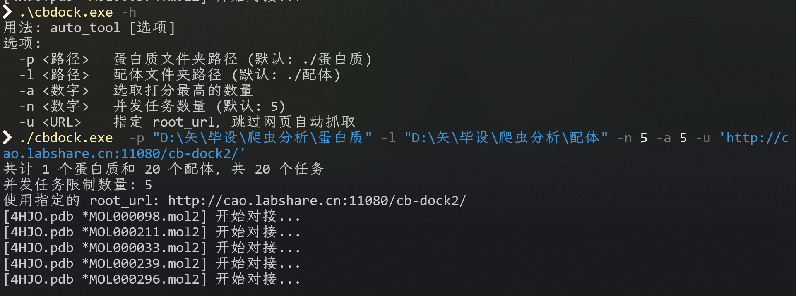
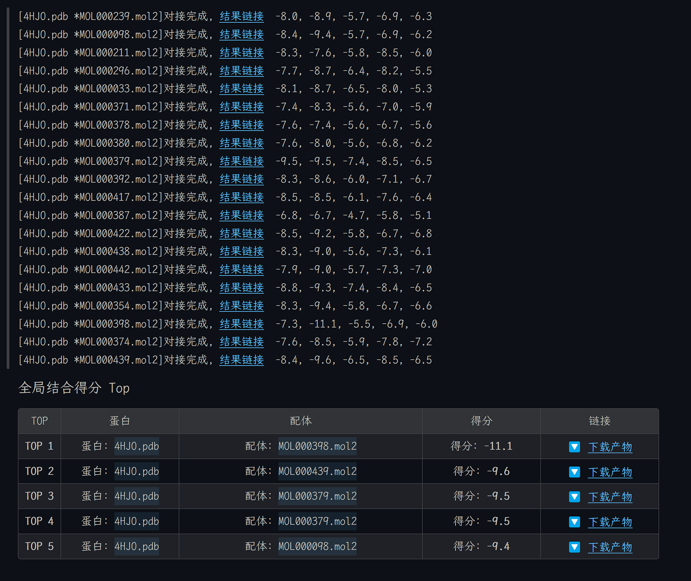

cb-dock2自动批量对接脚本，使用rust语言  
在进行毕设时需要使用cbdock2进行大量的对接工作, 十分繁琐, 且一个个统计打分情况十分麻烦, 故写下了该脚本批量对接以及爬取数据. 用法如下:  
| 选项 | 参数类型 | 介绍 |
| :---: | :---: | :---: |
| -p | <路径> | 蛋白质文件夹路径 (默认: ./蛋白质) |
| -l | <路径> | 配体文件夹路径 (默认: ./配体) |
| -a | <数字> | 选取打分最高的数量 |
| -n | <数字> | 并发任务数量 (默认: 5) |
| -u | <服务器url> | 指定基础url, eg: http://cao.labshare.cn:11080/cb-dock2, 否则使用默认服务器. 推荐事先访问cbdock2获取压力较轻的服务器url, 速度更快 |
| -h/--help |  | 帮助信息 | 

这里对获取到的蛋白质-配体对接文件进行了修改, 否则cbdock2给出的对接pdb文件格式plip网页不认, 找不到结合位点, 有需要可以点击链接下载, 所有链接都输出在终端以及result.md文件里了. 作者也不知道什么原因, 也不想知道  
  
